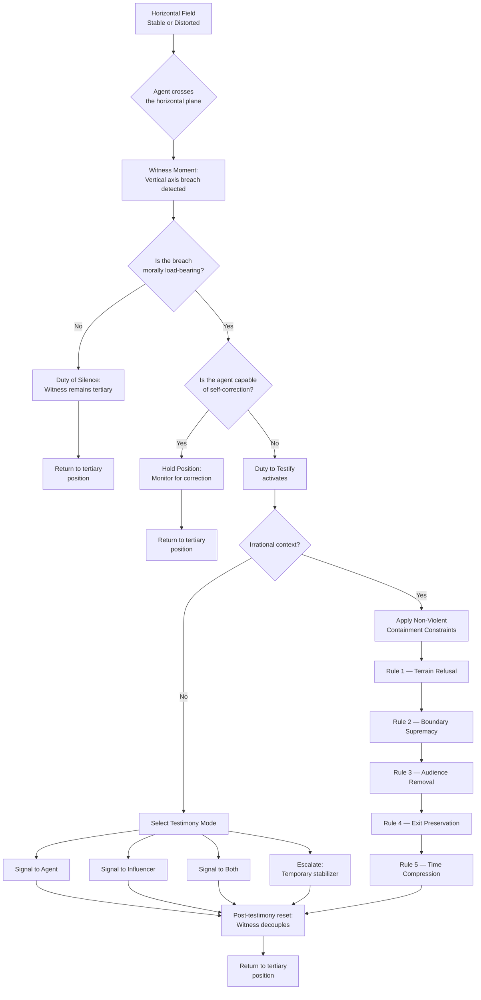

```mermaid
flowchart TD

  %% --- FIELD & ENTRY ---
  Field[Horizontal Field\nStable or Distorted] --> Entry{Agent crosses\nthe horizontal plane}

  %% --- WITNESS MOMENT ---
  Entry --> WitnessMoment[Witness Moment:\nVertical axis breach detected]
  WitnessMoment --> Q1{Is the breach\nmorally load-bearing?}

  %% --- IF NOT LOAD-BEARING ---
  Q1 -->|No| Silence[Duty of Silence:\nWitness remains tertiary]
  Silence --> Return1[Return to tertiary\nposition]

  %% --- IF LOAD-BEARING ---
  Q1 -->|Yes| Q2{Is the agent capable\nof self-correction?}
  Q2 -->|Yes| Hold[Hold Position:\nMonitor for correction]
  Hold --> Return2[Return to tertiary\nposition]

  %% --- SELF-CORRECTION NO -> DUTY TO TESTIFY ---
  Q2 -->|No| Testimony[Duty to Testify\nactivates]

  %% --- MODE SELECTOR (CONSTRAINT OVERLAY) ---
  Testimony --> ModeSel{Irrational context?}
  ModeSel -->|No| Mode[Select Testimony Mode]
  ModeSel -->|Yes| NV[Apply Non‑Violent\nContainment Constraints]

  %% --- TESTIMONY MODES (ALWAYS AVAILABLE) ---
  Mode --> M1[Signal to Agent]
  Mode --> M2[Signal to Influencer]
  Mode --> M3[Signal to Both]
  Mode --> M4[Escalate:\nTemporary stabilizer]

  %% --- CONSTRAINTS (ANNOTATIVE NODES) ---
  NV --> NV1[Rule 1 — Terrain Refusal]
  NV1 --> NV2[Rule 2 — Boundary Supremacy]
  NV2 --> NV3[Rule 3 — Audience Removal]
  NV3 --> NV4[Rule 4 — Exit Preservation]
  NV4 --> NV5[Rule 5 — Time Compression]

  %% --- RESET / DECOUPLE ---
  M1 --> Reset[Post‑testimony reset:\nWitness decouples]
  M2 --> Reset
  M3 --> Reset
  M4 --> Reset
  NV5 --> Reset
  Reset --> Return3[Return to tertiary\nposition]

```