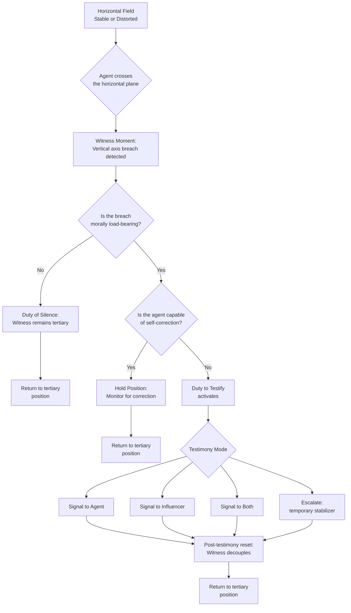
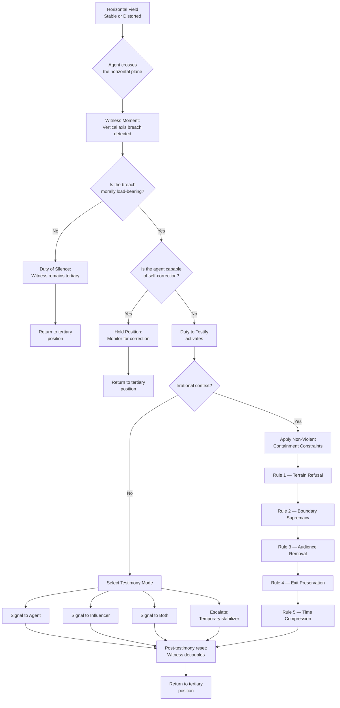

# CST/JPP Operator’s Manual — Combined

> Generated from the canonical modules in `/modules`.

## Table of Contents
1. [00 — Initial Statement](modules/00_initial-statement.md)
2. [01 — CST Fourfold Mapping](modules/01_cst-fourfold-mapping.md)
3. [02 — JPP Kata & Physics](modules/02_jpp-kata-and-physics.md)
4. [03 — Horizontal Virtue Matrix](modules/03_horizontal-virtue-matrix.md)
5. [04 — Vertical Axis](modules/04_vertical-axis.md)
6. [05 — Prudential Praxis](modules/05_prudential-praxis.md)
7. [06 — Vallor Integration](modules/06_vallor-integration.md)
8. [07 — Witness Moment Chart](modules/07_witness-moment-chart.md)
9. [08 — Containment of the Irrational Agent](modules/08_witness-moment-containment-irrational-agent.md)

---

---
title: CST–JPP: The Canonical Initial Statement
module: 00
version: 1.0
updated: 2026-02-01
author: Dominic G. Flamiano
links:
  - modules/00_initial-statement.md
  - modules/01_cst-fourfold-mapping.md
  - modules/02_jpp-kata-and-physics.md
  - modules/03_horizontal-virtue-matrix.md
  - modules/04_vertical-axis.md
  - modules/05_prudential-praxis.md
  - modules/06_vallor-integration.md
  - modules/07_witness-moment-chart.md
  - modules/08_witness-moment-containment-irrational-agent.md
  - case-studies/07_buddhist-march-on-petersburg.md
---

# CST–JPP: The Canonical Initial Statement

## 1. The Problem: Drift, Confusion, Opacity
Modern life accelerates faster than inherited judgment systems can metabolize. The symptoms are everywhere:
- **Drift** — losing orientation in the noise
- **Confusion** — collapsing under competing values and narratives
- **Opacity** — lacking a way to see what matters and what to do next

These are structural conditions, not personal failures. When the world becomes chaotic, the operator needs better instruments — not more willpower or slogans.

What’s missing is a shared grammar for making sense of moments and a disciplined method for acting inside them.

**The CST–JPP interface provides both.**

## 2. CST 2026: An Operator’s Manual for Moments
CST is not a library of principles. It is an operator’s manual for moments — a way of reading the world that preserves dignity, agency, and responsibility under pressure.

CST 2026 reframes the tradition as a moment‑diagnostic system built on four perennial questions:
- What human dignity is at stake
- What solidarity obligations are activated
- What structures of justice shape the field
- What common good must be protected or restored

These are axes of perception. CST gives the operator **moral altitude** — clarity about what kind of moment they are in.

## 3. JPP: Steering in a Chaotic World
The Judgment and Prudence Protocol (JPP) is the steering mechanism — a kata for disciplined action when the world is loud and ambiguous.

Where CST clarifies **what matters**, JPP clarifies **what to do**.

JPP provides:
- **Orientation** — naming the moment and its forces
- **Stability** — preventing drift and distortion
- **Pace** — matching tempo without being swallowed by it
- **Agency** — keeping the human operator at the moral center

Together, CST and JPP form a two‑part instrument:
- **CST:** See the moment
- **JPP:** Steer the moment

## 4. The Architecture: How the System Holds Under Load

### 4a. *Con + Facere*: The Shared Act of Making
Disciplined collaboration between agents, communities, and systems — the antidote to isolation and fragmentation.

### 4b. The Yoke and Harness
The yoke constrains tilt, prevents drift, and keeps the operator centered.
It stabilizes — it does not decide.

### 4c. Horizontal Stabilizers: The Cardinal Virtues
Prudence, Justice, Fortitude, Temperance — the plane that prevents roll into excess or collapse.

### 4d. Vertical Stabilizers: Faith, Hope, Love
The keel and direction — preventing yaw away from true course.

### 4e. The Moment of Witness
Where judgment becomes testimony. Where the architecture proves itself in lived reality.

## Canonical Closure
CST–JPP restores clarity, agency, responsibility, and the ability to act without distortion.
It is a manual for operating inside moments — **not a system for judging people.**

---
title: The CST Fourfold Test and Its Direct Mapping to Tradition
module: 01
version: 1.0
updated: 2026-02-01
author: Dominic G. Flamiano
links:
  - modules/00_initial-statement.md
  - modules/01_cst-fourfold-mapping.md
  - modules/02_jpp-kata-and-physics.md
  - modules/03_horizontal-virtue-matrix.md
  - modules/04_vertical-axis.md
  - modules/05_prudential-praxis.md
  - modules/06_vallor-integration.md
  - modules/07_witness-moment-chart.md
  - modules/08_witness-moment-containment-irrational-agent.md
  - case-studies/07_buddhist-march-on-petersburg.md
---

# The CST Fourfold Test and Its Direct Mapping to Tradition

## Operator’s Fourfold Test
1. Does this action restore **human dignity**?
2. Does it seed the garden of the **common good**?
3. Is it **sisterly and brotherly**, or not?
4. Does it uplift **the little ones**?

If the answer isn’t “yes” to all four, **it isn’t just**.

## Mapping to CST Pillars
- **Human Dignity** → “Restore human dignity.”
- **Common Good** → “Seed the garden of the common good.”
- **Solidarity** → “Is it sisterly and brotherly?”
- **Preferential Option for the Poor** → “Uplift the little ones.”

This is CST rendered as a **field‑ready instrument.**

---
title: JPP as Steering Mechanism and Internal Physics
module: 02
version: 1.0
updated: 2026-02-01
author: Dominic G. Flamiano
links:
  - modules/00_initial-statement.md
  - modules/01_cst-fourfold-mapping.md
  - modules/02_jpp-kata-and-physics.md
  - modules/03_horizontal-virtue-matrix.md
  - modules/04_vertical-axis.md
  - modules/05_prudential-praxis.md
  - modules/06_vallor-integration.md
  - modules/07_witness-moment-chart.md
  - modules/08_witness-moment-containment-irrational-agent.md
  - case-studies/07_buddhist-march-on-petersburg.md
---

# JPP as Steering Mechanism and Internal Physics

## JPP as Kata
JPP is a repeatable discipline for judgment under stress.
It stabilizes:

- **orientation**
- **pace**
- **proportion**
- **agency**

The kata ensures that the operator does not drift, accelerate without control, or collapse under ambiguity.

## Internal Physics of the Instrument
- **Con + facere** — shared action, collaborative making
- **Yoke** — constraint without domination; stabilizer, not decider
- **Horizontal stabilizers** — the cardinal virtues
- **Vertical stabilizers** — the theological virtues
- **Witness moment** — where action becomes testimony

These elements form the “internal physics” of the spinning‑top operator instrument.

---
title: The Horizontal Plane as a Virtue Matrix
module: 03
version: 1.0
updated: 2026-02-01
author: Dominic G. Flamiano
links:
  - modules/00_initial-statement.md
  - modules/01_cst-fourfold-mapping.md
  - modules/02_jpp-kata-and-physics.md
  - modules/03_horizontal-virtue-matrix.md
  - modules/04_vertical-axis.md
  - modules/05_prudential-praxis.md
  - modules/06_vallor-integration.md
  - modules/07_witness-moment-chart.md
  - modules/08_witness-moment-containment-irrational-agent.md
  - case-studies/07_buddhist-march-on-petersburg.md
---

# The Horizontal Plane as a Virtue Matrix

The cardinal virtues form a structured, analyzable matrix:

- **Prudence** — clarity, proportion, discernment
- **Justice** — fairness, reciprocity, right‑relation
- **Fortitude** — steadiness under pressure
- **Temperance** — restraint, pacing, non‑excess

Each virtue has:

- **definable criteria**
- **measurable distortions**
- **recognizable signatures**
- **predictable consequences**

This is the part of the instrument *legible to machine evaluation* — without ever judging the agent.

---
title: The Vertical Axis: The Spiritual Spine
module: 04
version: 1.0
updated: 2026-02-01
author: Dominic G. Flamiano
links:
  - modules/00_initial-statement.md
  - modules/01_cst-fourfold-mapping.md
  - modules/02_jpp-kata-and-physics.md
  - modules/03_horizontal-virtue-matrix.md
  - modules/04_vertical-axis.md
  - modules/05_prudential-praxis.md
  - modules/06_vallor-integration.md
  - modules/07_witness-moment-chart.md
  - modules/08_witness-moment-containment-irrational-agent.md
  - case-studies/07_buddhist-march-on-petersburg.md
---

# The Vertical Axis: The Spiritual Spine

The vertical axis is animated by:

- **Faith** — trust that the good is worth pursuing
- **Hope** — orientation toward a redeemable future
- **Love** — the governing intention toward the dignity of the other

These transcendent virtues:

- exceed calculation
- cannot be automated
- belong uniquely to the human soul

They give the instrument **purpose, direction, and moral depth**.

---
title: CST/JPP as Prudential Praxis in Motion
module: 05
version: 1.0
updated: 2026-02-01
author: Dominic G. Flamiano
links:
  - modules/00_initial-statement.md
  - modules/01_cst-fourfold-mapping.md
  - modules/02_jpp-kata-and-physics.md
  - modules/03_horizontal-virtue-matrix.md
  - modules/04_vertical-axis.md
  - modules/05_prudential-praxis.md
  - modules/06_vallor-integration.md
  - modules/07_witness-moment-chart.md
  - modules/08_witness-moment-containment-irrational-agent.md
  - case-studies/07_buddhist-march-on-petersburg.md
---

# CST/JPP as Prudential Praxis in Motion

CST/JPP trains the operator to act:

- in the moment
- with direction
- mindfully
- with purpose

This is prudence in praxis — the art of choosing the next right action under real conditions.

Through repeated use:

- perception sharpens
- stabilizers internalize
- moral reflexes form
- posture becomes disposition

**The instrument becomes the operator.**

---
title: The Witness Moment as the Missing Hinge in Vallor’s Framework
module: 06
version: 1.0
updated: 2026-02-01
author: Dominic G. Flamiano
links:
  - modules/00_initial-statement.md
  - modules/01_cst-fourfold-mapping.md
  - modules/02_jpp-kata-and-physics.md
  - modules/03_horizontal-virtue-matrix.md
  - modules/04_vertical-axis.md
  - modules/05_prudential-praxis.md
  - modules/06_vallor-integration.md
  - modules/07_witness-moment-chart.md
  - modules/08_witness-moment-containment-irrational-agent.md
  - case-studies/07_buddhist-march-on-petersburg.md
---

# The Witness Moment as the Missing Hinge in Vallor’s Framework

Shannon Vallor argues that virtue must be *practiced*, not merely believed.
Your architecture identifies the missing mechanism.

## The Witness Moment

The instant when the human agent penetrates the horizontal plane *in actus* —
when virtue becomes embodied and the soul enters the world through action.

This hinge:

- operationalizes Vallor’s theory
- restores clarity against AI‑induced drift
- preserves human moral centrality
- reveals the irreducible domain of the vertical axis

**This is where your system breathes life into Vallor’s.**

---
title: Witness Moment Decision Chart
module: 07
version: 1.0
updated: 2026-02-01
author: Dominic G. Flamiano
links:
  - modules/00_initial-statement.md
  - modules/01_cst-fourfold-mapping.md
  - modules/02_jpp-kata-and-physics.md
  - modules/03_horizontal-virtue-matrix.md
  - modules/04_vertical-axis.md
  - modules/05_prudential-praxis.md
  - modules/06_vallor-integration.md
  - modules/07_witness-moment-chart.md
  - modules/08_witness-moment-containment-irrational-agent.md
  - case-studies/07_buddhist-march-on-petersburg.md
---

# Witness Moment Decision Chart

---
title: Witness Moment: Containment of the Irrational Agent
module: 08
version: 1.0
updated: 2026-02-01
author: Dominic G. Flamiano
links:
  - modules/00_initial-statement.md
  - modules/01_cst-fourfold-mapping.md
  - modules/02_jpp-kata-and-physics.md
  - modules/03_horizontal-virtue-matrix.md
  - modules/04_vertical-axis.md
  - modules/05_prudential-praxis.md
  - modules/06_vallor-integration.md
  - modules/07_witness-moment-chart.md
  - modules/08_witness-moment-containment-irrational-agent.md
  - case-studies/07_buddhist-march-on-petersburg.md
---

# Witness Moment: Containment of the Irrational Agent

